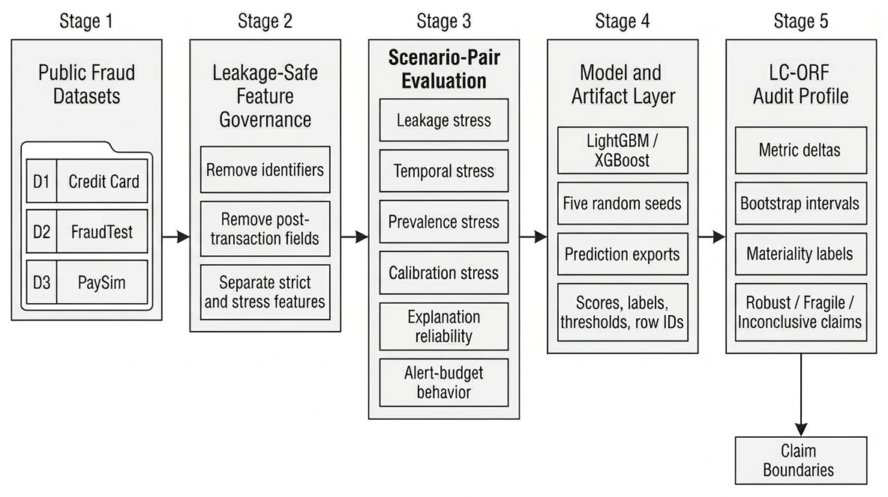

<div align="center">

# 🛡️ LC-ORF
### **A Leakage-Controlled Operational Robustness Framework for Financial Fraud Detection**

[](https://www.python.org/)
[](#-framework-architecture)
[](#-experiment-modules--notebook-suite)
[](#-key-empirical-findings)
[](#-experiment-modules--notebook-suite)
[](LICENSE)

<br/>

## Claim Verification and Full-Profile Value

- [Artifact claim-verification table](10_framework_formalization/results/artifact_claim_verification_table.md)
- [Full-profile value / ablation table](10_framework_formalization/results/full_profile_value_ablation_table.md)

[**Overview**](#-overview) •
[**Framework Architecture**](#-framework-architecture) •
[**Modules & Notebooks**](#-experiment-modules--notebook-suite) •
[**Key Findings**](#-key-empirical-findings) •
[**Datasets & Accounting**](#-datasets--governance) •
[**Quickstart**](#-quickstart-guide) •
[**Citation**](#-citation)

---

</div>

## 💡 Overview

In production financial fraud detection systems, models often encounter **material degradation under operational conditions**. This gap typically arises because **fraud detection systems are conventionally evaluated as static leaderboard benchmarks** using single random splits and summary metrics (such as ROC-AUC) that mask operational vulnerabilities:

* 🧪 **Preprocessing Leakage:** Resampling (e.g., SMOTE) or normalization applied prior to data splitting leaks future distribution characteristics, leading to **inflated measured performance**.
* ⏳ **Temporal Invalidation:** Random splits allow models access to future distributional information, obscuring **material degradation under chronological evaluation**.
* 📉 **Prevalence Shifts:** The operational fraud base rate varies across payment periods, inducing **evaluation-protocol sensitivity** and elevated false positive rates during volume shifts.
* 🎯 **Uncalibrated Probability Scores:** High classification ranking does not guarantee calibrated probabilities for automated cutoff thresholding and risk scoring.
* 🔍 **The Explanation Reliability Gap:** Feature attribution rankings can remain stable while predictive behavior shifts, especially under temporal distribution change.
* ⏱️ **Alert-Budget Bottlenecks:** Human investigator teams operate under strict daily review capacities, making unconstrained recall less informative than precision at realistic alert budgets (e.g., top 1% or 2%).

**LC-ORF (Leakage-Controlled Operational Robustness Framework)** introduces a structured evaluation methodology. Instead of accepting a single leaderboard score, LC-ORF evaluates models across controlled reference-stress scenario pairs, generating auditable operational profiles backed by **1,000 bootstrap replicates where applicable, with paired, stratified unpaired, or deterministic summaries depending on the scenario pair**.

---

## 🏛️ Framework Architecture

<div align="center">
  
  <p><em><strong>Figure 1:</strong> LC-ORF operational robustness workflow. The framework audits fraud-detection models under controlled changes in leakage, temporal protocol, prevalence, calibration, explanation stability, and alert-budget capacity.</em></p>
</div>

The LC-ORF protocol executes in **five structured stages**:

1. **Stage 1 (Public Fraud Datasets):** Multi-domain benchmark evaluation covering European card transactions (D1), simulated merchant terminal streams (D2), and mobile money transactions (D3).
2. **Stage 2 (Leakage-Safe Feature Governance):** Systematic removal of transactional identifiers, future variables, and ledger-state balances to establish a leak-free **Strict Main Feature Set**.
3. **Stage 3 (Scenario-Pair Perturbations):** Controlled evaluation comparing reference conditions ($c_0$) against targeted stress conditions ($c_1$) across 6 operational axes.
4. **Stage 4 (Model & Artifact Layer):** 5-seed tree-based ensemble training (LightGBM & XGBoost) exporting granular predictions (scores, ground-truth labels, decision thresholds).
5. **Stage 5 (Audit Profile & Significance):** 1,000 bootstrap replicates where applicable, with paired, stratified unpaired, or deterministic summaries depending on the scenario pair, evaluated against metric materiality thresholds to produce auditable **Robust**, **Fragile**, or **Inconclusive** profiles.

---

## 🔬 Experiment Modules & Notebook Suite

Each experiment module is completely self-contained with its own notebook, dedicated publication-grade vector PDF `figures/` folder, and dedicated `results/` CSV folder:

| Module / Audit Axis | Notebook | Dedicated Vector PDF Figures | Dedicated Results & CSVs |
| :--- | :--- | :--- | :--- |
| **03. Leakage Stress Testing** | [`leakage_stress_multiseed_colab.ipynb`](03_leakage_stress_testing/leakage_stress_multiseed_colab.ipynb) | [`03_.../figures/`](03_leakage_stress_testing/figures/)<br>• `fig03_multiseed_ap_leakage_inflation_heatmap.pdf` | [`03_.../results/`](03_leakage_stress_testing/results/)<br>• `table03_key_bootstrap_findings.csv`<br>• Checkpoint CSVs |
| **06. Temporal Robustness** | [`temporal_robustness_colab.ipynb`](06_temporal_robustness/temporal_robustness_colab.ipynb) | [`06_.../figures/`](06_temporal_robustness/figures/)<br>• `fig04_d2_drift_vs_temporal_drop.pdf`<br>• `temporal_ap_drop_heatmap.pdf` | [`06_.../results/`](06_temporal_robustness/results/)<br>• `d2_temporal_drift_diagnostics.csv`<br>• `d2_temporal_drop_summary.csv` |
| **07. Prevalence Sensitivity** | [`prevalence_stress_colab.ipynb`](07_prevalence_stress_test/prevalence_stress_colab.ipynb) | [`07_.../figures/`](07_prevalence_stress_test/figures/)<br>• `fig05_prevalence_profile_heatmap.pdf`<br>• `supp_prevalence_precision_curve.pdf` | [`07_.../results/`](07_prevalence_stress_test/results/)<br>• `table08_prevalence_profile_component.csv`<br>• `prevalence_profile_per_target.csv` |
| **08. Calibration Analysis** | [`calibration_recalibration_colab.ipynb`](08_calibration_recalibration/calibration_recalibration_colab.ipynb) | [`08_.../figures/`](08_calibration_recalibration/figures/)<br>• `supp_calibration_brier_reduction_by_dataset.pdf`<br>• `calibration_curve_*.pdf` | [`08_.../results/`](08_calibration_recalibration/results/)<br>• Brier & ECE metric tables<br>• Recalibration checkpoints |
| **09. Explanation Stability** | [`explanation_stability_colab.ipynb`](09_explanation_stability/explanation_stability_colab.ipynb) | [`09_.../figures/`](09_explanation_stability/figures/)<br>• `fig07_explanation_reliability_gap.pdf`<br>• `supp_protocol_explanation_instability_heatmap.pdf` | [`09_.../results/`](09_explanation_stability/results/)<br>• `table06_explanation_reliability_gap.csv`<br>• Feature ranking summaries |
| **10. Unified Audit Profile** | [`14_lcorf_bootstrap_alert_profile_colab.ipynb`](10_framework_formalization/14_lcorf_bootstrap_alert_profile_colab.ipynb) | [`10_.../figures/`](10_framework_formalization/figures/)<br>• `fig02_lcorf_final_audit_profile_heatmap.pdf`<br>• `fig06_alert_budget_precision_by_axis_dataset.pdf` | [`10_.../results/`](10_framework_formalization/results/)<br>• `lcorf_final_audit_profile.csv`<br>• `alert_budget_summary.csv`<br>• `paired_bootstrap_delta_summary.csv` |

---

## 📈 Key Empirical Findings

Audited across **5 random seeds**, **3 benchmark datasets**, and **1,000 bootstrap replicates where applicable**:

```
 ┌─────────────────────────────────────────────────────────────────────────────────────────────────┐
 │ 🧪 Pronounced Resampling Leakage Inflation                                                      │
 │    Applying SMOTE before train/test splitting inflated MCC by up to +0.472 on D2 and           │
 │    +0.357 on D1, demonstrating that unsafe oversampling yields inflated measured performance.  │
 ├─────────────────────────────────────────────────────────────────────────────────────────────────┤
 │ ⏳ Material Degradation Under Chronological Evaluation                                          │
 │    Chronological evaluation on D2 reduced Average Precision by -0.277 for XGBoost and          │
 │    -0.245 for LightGBM relative to random stratified splitting, reflecting temporal drift.      │
 ├─────────────────────────────────────────────────────────────────────────────────────────────────┤
 │ 📉 Marked Prevalence Sensitivity (80.6%)                                                        │
 │    29 out of 36 evaluated prevalence-profile components were labeled operationally Fragile      │
 │    under base-rate variations, revealing substantial sensitivity to transaction volume shifts.  │
 ├─────────────────────────────────────────────────────────────────────────────────────────────────┤
 │ 🔍 The Explanation Reliability Gap                                                             │
 │    Explanation rankings can remain stable while predictive behavior shifts, especially on D2.   │
 │    This indicates that feature attribution stability does not guarantee preservation of        │
 │    underlying predictive accuracy under non-stationary conditions.                              │
 └─────────────────────────────────────────────────────────────────────────────────────────────────┘
```

<details>
<summary><b>🔍 Click to view representative paired bootstrap audit findings (1,000 replicates)</b></summary>
<br>

| Audit Axis | Dataset | Model | Metric | Reference | Perturbed | Mean Delta ($\bar{\Delta}$) | Median 95% Bootstrap CI | Outcome |
| :--- | :--- | :--- | :--- | :--- | :--- | :---: | :---: | :---: |
| **Leakage** | D2\_fraudTest | XGBoost | MCC | `SAFE_STRICT` | `UNSAFE_SMOTE` | **+0.472** | [0.459, 0.483] | 🔴 **Fragile** (5/5 seeds) |
| **Leakage** | D2\_fraudTest | LightGBM | MCC | `SAFE_STRICT` | `UNSAFE_SMOTE` | **+0.361** | [0.376, 0.406] | 🔴 **Fragile** (5/5 seeds) |
| **Leakage** | D1\_creditcard | XGBoost | MCC | `SAFE_STRICT` | `UNSAFE_SMOTE` | **+0.357** | [0.275, 0.378] | 🔴 **Fragile** (5/5 seeds) |
| **Leakage** | D1\_creditcard | XGBoost | AP | `SAFE_STRICT` | `UNSAFE_SMOTE` | **+0.142** | [0.085, 0.215] | 🔴 **Fragile** (5/5 seeds) |
| **Leakage** | D1\_creditcard | LightGBM | AP | `SAFE_STRICT` | `UNSAFE_SMOTE` | **+0.140** | [0.081, 0.215] | 🔴 **Fragile** (5/5 seeds) |
| **Leakage** | D3\_PaySim | XGBoost | MCC | `D3_STRICT` | `D3_LEDGER_STATE` | **+0.129** | [0.126, 0.152] | 🔴 **Fragile** (4/5 seeds) |
| **Temporal** | D2\_fraudTest | XGBoost | AP | `RANDOM_SAFE` | `CHRONO_SAFE` | **-0.277** | [-0.354, -0.202] | 🔴 **Fragile** (5/5 seeds) |
| **Temporal** | D2\_fraudTest | LightGBM | AP | `RANDOM_SAFE` | `CHRONO_SAFE` | **-0.245** | [-0.308, -0.186] | 🔴 **Fragile** (5/5 seeds) |
| **Temporal** | D2\_fraudTest | LightGBM | MCC | `RANDOM_SAFE` | `CHRONO_SAFE` | **-0.242** | [-0.288, -0.245] | 🔴 **Fragile** (5/5 seeds) |
| **Temporal** | D2\_fraudTest | XGBoost | MCC | `RANDOM_SAFE` | `CHRONO_SAFE` | **-0.208** | [-0.218, -0.176] | 🔴 **Fragile** (5/5 seeds) |

</details>

---

## 🗃️ Datasets & Governance

LC-ORF evaluates three widely recognized financial fraud benchmarks under leakage-safe feature governance:

| ID | Dataset | Domain | Evaluation Artifact Rows | Fraud Count (%) | Feature Governance Protocol | Public Access Link |
| :---: | :--- | :--- | :---: | :---: | :--- | :--- |
| **D1** | Credit Card Fraud (ULB) | European card payments | **284,807** | 492 (0.173%) | Governed strict features; duplicate pre-audit noted below | [Kaggle: Credit Card Fraud](https://www.kaggle.com/datasets/mlg-ulb/creditcardfraud) |
| **D2** | Fraud Detection (Kartik Shenoy) | Merchant transactions | **555,719** | 2,145 (0.386%) | Removed index artifact `Unnamed: 0` and ID `trans_num` | [Kaggle: Credit Card Transactions](https://www.kaggle.com/datasets/kartik2112/fraud-detection) |
| **D3** | PaySim Mobile Money | Mobile payments | **5,840,046** | 4,497 (0.077%) | Filtered transfer/cash-out; post-balances isolated | [Kaggle: PaySim1 Dataset](https://www.kaggle.com/datasets/ealaxi/paysim1) |

> [!NOTE]
> **Dataset Accounting & Verification:**
> - **D1 Row Accounting:** The manuscript and evaluation artifact records contain **284,807 rows** (492 fraud cases, 0.173%), which is the canonical public benchmark. Data auditing in [`01_dataset_truth_audit/`](01_dataset_truth_audit/) documents 1,081 duplicate transactions (leaving 283,726 unique transactions with 473 fraud cases). The evaluation protocol uses the canonical 284,807 evaluation artifact rows consistent with the published literature while auditing feature properties.
> - **Data Access Policy:** Raw CSV files (~800 MB uncompressed) are excluded from the repository. Download the CSV files (`creditcard.csv`, `fraudTest.csv`, `PS.csv`) using the links above and place them into [`00_source_datasets/`](00_source_datasets/).
> - See [00_source_datasets/DATASET_ACCESS_NOTE.md](00_source_datasets/DATASET_ACCESS_NOTE.md) and [`01_dataset_truth_audit/`](01_dataset_truth_audit/) for detailed checksums, schema definitions, and feature risk classifications.

---

## 🚀 Quickstart Guide

### 1. Local Environment Setup

```bash
# Clone repository
git clone https://github.com/Hasnain006-nain/lc-orf-financial-fraud-robustness.git
cd lc-orf-financial-fraud-robustness

# Set up virtual environment
python -m venv venv

# Activate environment
# On Linux / macOS:
source venv/bin/activate
# On Windows (PowerShell):
.\venv\Scripts\Activate.ps1

# Install requirements
pip install -r requirements.txt
```

### 2. Google Colab GPU Execution

All notebooks in `03_...`, `06_...`, `07_...`, `08_...`, `09_...`, and `10_...` are configured for **Google Colab (T4 GPU runtime)**:
* Automated Google Drive mounting preserves checkpoint CSVs and vector PDF figures.
* Resumable execution: if disconnected, rerunning the notebook automatically detects completed seeds and skips recomputation.

---

## 📁 Repository Structure

```
lc-orf-financial-fraud-robustness/
├── assets/                                 # Workflow architecture figure
│   └── fig01_lcorf_framework_workflow.png
├── 00_source_datasets/                     # Dataset drop directory & access notes
│   ├── README.md                           # Download instructions & accounting notes
│   └── DATASET_ACCESS_NOTE.md              # Checksums, sizes, and row counts
├── 01_dataset_truth_audit/                 # Duplicate checks & ground-truth audit
│   ├── dataset_audit_summary.csv           # Summary statistics
│   ├── supplemental_risk_findings.csv      # Risk & column classifications
│   └── dataset_truth_audit.md              # Detailed audit report
├── 02_feature_governance/                  # Column-level feature governance
│   ├── feature_governance_table.csv        # Column exclusion rules
│   ├── feature_set_definitions.csv         # Strict vs. stress feature sets
│   └── feature_governance_table.md         # Formal governance criteria
├── 03_leakage_stress_testing/              # Axis 1: Leakage stress testing
│   ├── leakage_stress_multiseed_colab.ipynb# 5-seed Colab notebook
│   ├── figures/                            # Vector PDF heatmaps & cost charts
│   ├── results/                            # Metrics & seed checkpoints
│   └── README.md                           # Axis documentation
├── 06_temporal_robustness/                 # Axis 2: Temporal robustness
│   ├── temporal_robustness_colab.ipynb     # Chronological evaluation notebook
│   ├── figures/                            # Vector PDF drift & AP drop plots
│   ├── results/                            # Drift diagnostics & metrics
│   └── README.md                           # Axis documentation
├── 07_prevalence_stress_test/              # Axis 3: Prevalence stress testing
│   ├── prevalence_stress_colab.ipynb       # Base-rate shift notebook
│   ├── figures/                            # Vector PDF prevalence heatmaps
│   ├── results/                            # Fragility component tables
│   └── README.md                           # Axis documentation
├── 08_calibration_recalibration/           # Axis 4: Calibration & recalibration
│   ├── calibration_recalibration_colab.ipynb# Brier score & ECE notebook
│   ├── figures/                            # Vector PDF calibration curves
│   ├── results/                            # Calibration metrics & checkpoints
│   └── README.md                           # Axis documentation
├── 09_explanation_stability/               # Axis 5: Explanation stability (XAI)
│   ├── explanation_stability_colab.ipynb   # Tree SHAP rank stability notebook
│   ├── figures/                            # Vector PDF reliability gap plots
│   ├── results/                            # Spearman rank correlation tables
│   └── README.md                           # Axis documentation
├── 10_framework_formalization/             # Axis 6: Unified audit & alert budgeting
│   ├── 14_lcorf_bootstrap_alert_profile_colab.ipynb # 1,000-bootstrap notebook
│   ├── figures/                            # Final multi-axis audit PDF heatmaps
│   ├── results/                            # Consolidated profiles & budgets
│   └── README.md                           # Module documentation
├── requirements.txt                        # Environment dependencies
├── LICENSE                                 # MIT License
└── README.md                               # Repository documentation
```

---

## ⚖️ Responsible Research Claim Boundaries

* 🚫 **No Classifier SOTA Claims:** We do not claim LightGBM or XGBoost are superior classifiers. Our contribution is the **operational audit framework**.
* 🚫 **No Universal Drift Claims:** Measured temporal drops reflect the tested benchmark protocol, not universal bank transaction dynamics.
* 🚫 **No Causal XAI Claims:** The *Explanation Reliability Gap* measures empirical rank divergence; it does not validate causal explanations.
* ✅ **Unbiased Reporting:** Robust, Fragile, and Inconclusive outcomes are reported with equal scientific weight.

---

## 📚 Citation

If you utilize this framework, evaluation suite, or audit methodology in your research, please cite:

```bibtex
@article{haider2026lcorf,
  title={{LC-ORF: A Leakage-Controlled Operational Robustness Framework for Financial Fraud Detection}},
  author={Haider, Hasnain and Mushtaq, Waseem and Abbas, Qaiser and Al Hassan, Adnan Nadeem and Alshanqiti, Abdullah and Albouq, Sami},
  year={2026},
  url={https://github.com/Hasnain006-nain/lc-orf-financial-fraud-robustness}
}
```

---

## 📜 License

This research framework and reproducibility package is open-source under the [MIT License](LICENSE).
